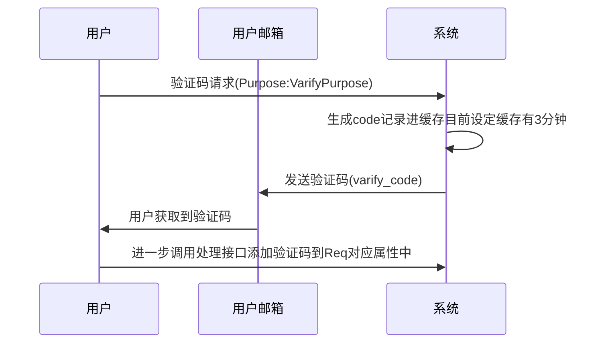

# GateServer

* port=6000
* host=http://

## id格式:
```typescript
与下面Res和Req对应
export enum HttpId{
    UserLogin=10001,
    UserRegistered=10002,
    VarifyCode=10003,
    UpdateUserAreaData=10004,
    UpdateUserData=10005,
    UpdateUserPassword=10006,
}
```

## ErrorCode格式
```typescript
export enum GateServerErrorCode{
    Fali=0,
    Success=1,
    VarifyCodeErr=2,
}
```
## VarifyPurpose
```ts
export enum VarifyPurpose{
    Registered=1,
    UpdatePassword=2,
}
```

# Http Req / Res 对照表 (左右两栏)

## 目录
- [UserLogin = 10001](#userlogin--10001)
- [UserRegistered = 10002](#userregistered--10002)
- [VarifyCode = 10003](#varifycode--10003)
- [UpdateUserAreaData = 10004](#updateuserareadata--10004)
- [UpdateUserData = 10005](#UpdateUserData--10005)
- [UpdateUserPassword = 10006](#UpdateUserPassword--10006)
---

### UserLogin = 10001

<div style="display:flex; gap:20px;">

  <div style="flex:1;">

  ```ts
  路由路径:/PigChessApi/UserLogin
  export interface UserLoginReq {
      id: HttpId;
      uid: number;
      UserName: string;
      Email: string;
      NickName: string;
      Phone: string;
      PassWord: string;
  }
  ```
  </div>

  <div style="flex:1;">

  ```ts
  export interface UserLoginRes {
      id: HttpId;
      error: ErrorCode;
      tokenstr: string;
      userid: number;
      iconurl: string;
  }
  ```
  </div>

</div>

---

### UserRegistered = 10002

<div style="display:flex; gap:20px;">

  <div style="flex:1;">

  ```ts
  路由路径:/PigChessApi/UserRegistered
  export interface UserRegisteredReq {
      id: HttpId;
      UserName: string;
      Email: string;
      PassWord: string;
      NickName: string;
      Phone: string;
      VarifyCode: string;
  }
  ```
  </div>

  <div style="flex:1;">

  ```ts
  export interface UserRegisteredRes {
      id: HttpId;
      error: ErrorCode;
  }
  ```
  </div>

</div>

---

### VarifyCode = 10003

<div style="display:flex; gap:20px;">

  <div style="flex:1;">

  ```ts
  路由路径:/PigChessApi/GetVarifyCode
  export interface VarifyCodeReq{
    id:HttpId;
    Email: string;
    Purpose: VarifyPurpose;
}
  ```
  </div>

  <div style="flex:1;">

  ```ts
  export interface VarifyCodeRes {
      id: HttpId;
      error: ErrorCode;
  }
  ```
  </div>

</div>

---

### UpdateUserAreaData = 10004

<div style="display:flex; gap:20px;">

  <div style="flex:1;">

  ```ts
路由路径:/PigChessAdmin/UpdateUserAreaData
该方法属于同时修改一个给表项的多个数据,不用修改的直接填0就行
p_area_id是用户所在的区目前只有1区,填1就行,后续会建立区名称与区号的映射表
p_user_id为登录后获取到的用户唯一id属于必须填写的项
export interface UpdateUserAreaDataReq{
    id:HttpId;
    p_area_id: string;
    p_user_id: number;
    p_coin_change_num: number;
    p_diamond_change_num: number;
    p_pigcoin_change_num: number;
    p_rankpoint_change_num: number;
    p_exppoint_change_num: number;
    p_S00_change_num: number;
    p_S01_change_num: number;
}
  ```
  </div>

  <div style="flex:1;">

  ```ts
export interface UpdateUserAreaDataRes{
    id:HttpId;
    error:ErrorCode;
}
  ```
  </div>

</div>

---

### UpdateUserData = 10005

<div style="display:flex; gap:20px;">

  <div style="flex:1;">

  ```ts
路由路径:/PigChessAdmin/UpdateUserData
export interface UpdateUserDataReq{
    id:HttpId;
    p_id : number,
    p_username:string,
    p_password:string,
    p_new_username:string,
    p_new_email:string,
    p_new_phone:string,
    p_new_nickname :string,
    p_new_iconurl:string,
    p_new_iconBase64:string
}
  ```
  </div>

  <div style="flex:1;">

  ```ts
export interface UpdateUserDataRes{
    id:HttpId;
    error:ErrorCode;
}
  ```
  </div>

</div>

---

### UpdateUserPassword = 10006

<div style="display:flex; gap:20px;">

  <div style="flex:1;">

  ```ts
路由路径:/PigChessApi/UpdateUserPassword
使用前要求先调用VarifyCode,Purpose为VarifyPurpose.UpdatePassword获取到邮箱的varify_code先
export interface UpdateUserPasswordReq{
    id:HttpId;
    p_email: string,
    p_new_password: string,
    varify_code: string,
}
  ```
  </div>

  <div style="flex:1;">

  ```ts
export interface UpdateUserPasswordRes{
    id:HttpId;
    error:ErrorCode;
}
  ```
  </div>

</div>

---