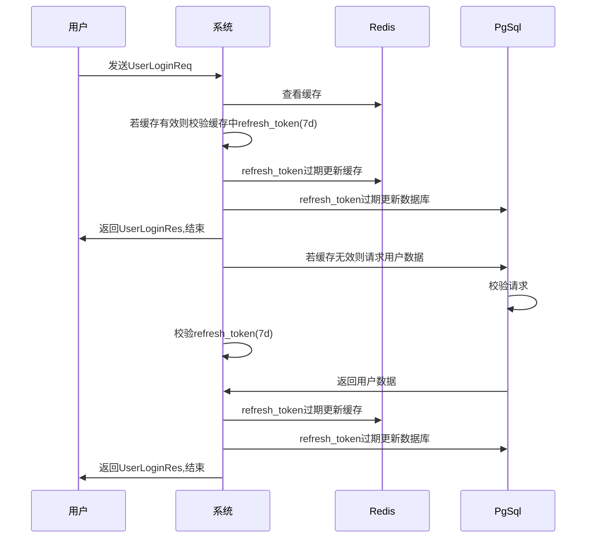
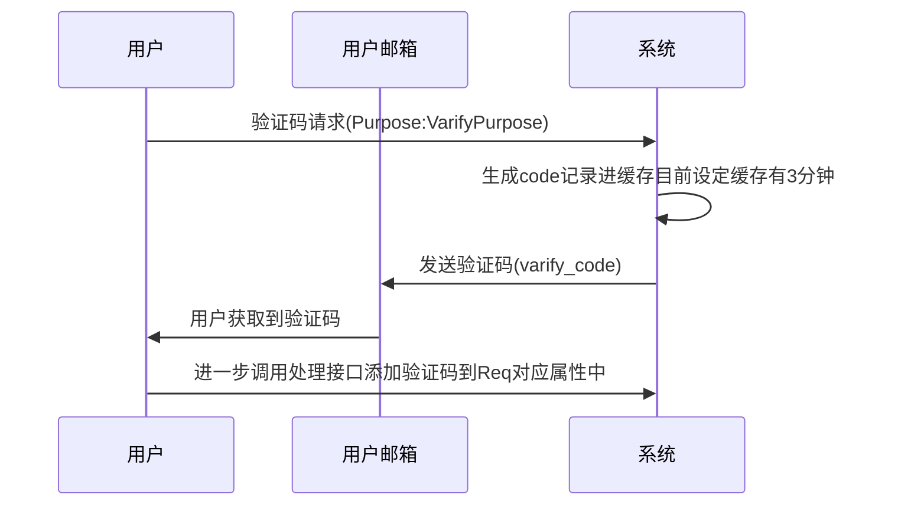
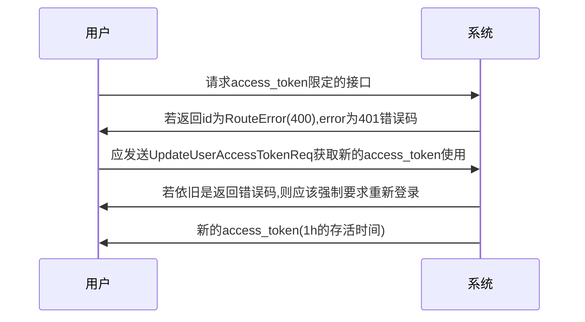
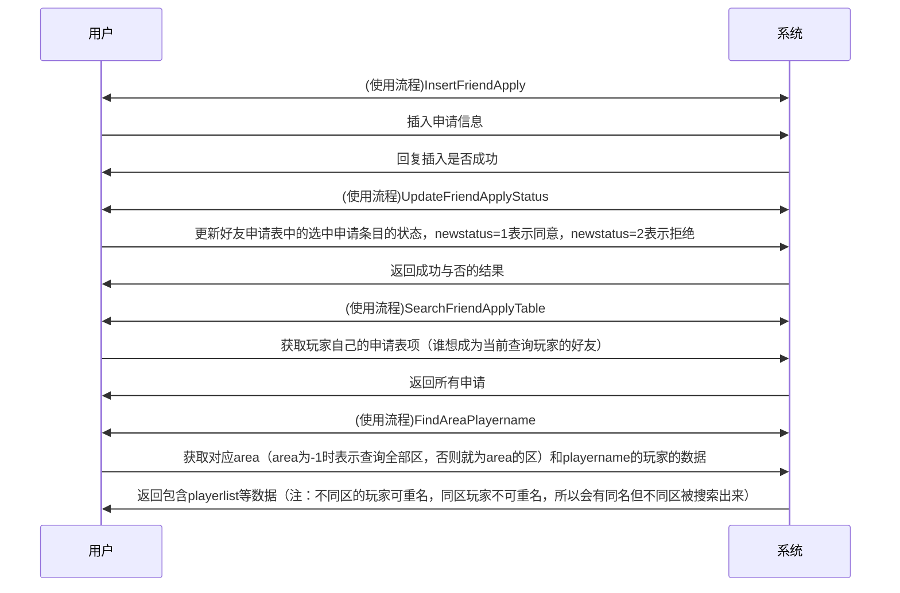
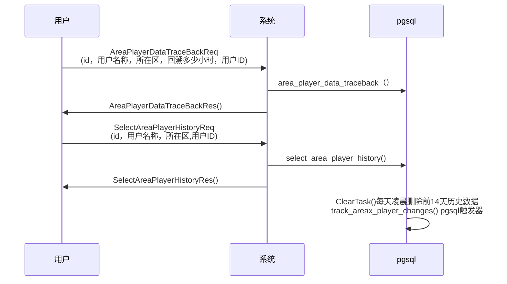

# GateServer

* port=6000
* host=http://

## id格式:
```typescript
与下面Res和Req对应
export enum HttpId{
    RouteError=400,

    UserLogin=10001,
    UserRegistered=10002,
    VarifyCode=10003,
    UpdateUserAreaData=10004,
    UpdateUserData=10005,
    UpdateUserPassword=10006,
    UpdateUserAccessToken=10007,


    InsertFriendApply=20001,
    UpdateFriendApplyStatus=20002,
    SearchFriendApplyTable=20003,
    FindAreaPlayername=20004,

    AreaPlayerDataTraceBack=30001,
    SelectAreaPlayerHistory=30002,
}
```
## 接口Token限定
```ts
要求必须在header携带access_token(有效时间1小时)
app.use('/PigChessAdmin',expressjwt({ secret: process.env.ACCESS_TOKEN_SECRET!, algorithms: ['HS256'] }))

要求必须在header携带refresh_token(有效时间7天)
app.use('/PigChessTokenApi',expressjwt({ secret: process.env.REFRESH_TOKEN_SECRET!, algorithms: ['HS256'] }))
```
---
## ErrorCode格式
```typescript
export enum GateServerErrorCode{
    Fali=0,
    Success=1,
    VarifyCodeErr=2,
    UnauthorizedError=401,
}
```
## VarifyPurpose
```ts
export enum VarifyPurpose{
    Registered=1,
    UpdatePassword=2,
}
```

# Http Req / Res 对照表 (左右两栏)

## 目录
<!-- - [](#) -->
- [RouteError = 400](#RouteError--400)
- [UserLogin = 10001](#userlogin--10001)
- [UserRegistered = 10002](#userregistered--10002)
- [VarifyCode = 10003](#varifycode--10003)
- [UpdateUserAreaData = 10004](#updateuserareadata--10004)
- [UpdateUserData = 10005](#UpdateUserData--10005)
- [UpdateUserPassword = 10006](#UpdateUserPassword--10006)
- [UpdateUserAccessToken = 10007](#UpdateUserAccessToken--10007)

- [好友功能全流程](#好友功能全流程)
  - [InsertFriendApply = 20001](#InsertFriendApply--20001)
  - [UpdateFriendApplyStatus = 20002](#UpdateFriendApplyStatus--20002)
  - [SearchFriendApplyTable = 20003](#SearchFriendApplyTable--20003)
  - [FindAreaPlayername = 20004](#FindAreaPlayername--20004)
- [历史表功能全流程](#历史表功能全流程)
  - [AreaPlayerDataTraceBack = 30001](#AreaPlayerDataTraceBack--30001)
  - [SelectAreaPlayerHistory = 30002](#SelectAreaPlayerHistory--30002)
---
### RouteError=400
路由错误通用id,具体错误看错误码的枚举类型
<div style="display:flex; gap:20px;">

  <div style="flex:1;">

  ```ts
  export interface RouteErrorRes{
    id:HttpId;
    error:ErrorCode
}
  ```
  </div>

</div>

---


### UserLogin = 10001


<div style="display:flex; gap:20px;">

  <div style="flex:1;">

  ```ts
  路由路径:/PigChessApi/UserLogin
  export interface UserLoginReq {
      id: HttpId;
      uid: number;
      UserName: string;
      Email: string;
      NickName: string;
      Phone: string;
      PassWord: string;
  }
  ```
  </div>

  <div style="flex:1;">

  ```ts
refresh_token长效token,7天有效期,用来获取敏感接口的access_token
access_token短效token,1小时有效期,用来访问数据增删改查的接口,每次登录会先给一次,后面过期了要通过UpdateUserAccessTokenRes重新获取
export interface UserLoginRes{
    id:HttpId;
    error:ErrorCode;
    refresh_token: string;
    access_token: string;
    userid: number;
    iconurl: string;
}
  ```
  </div>

</div>

---

### UserRegistered = 10002

<div style="display:flex; gap:20px;">

  <div style="flex:1;">

  ```ts
  路由路径:/PigChessApi/UserRegistered
  export interface UserRegisteredReq {
      id: HttpId;
      UserName: string;
      Email: string;
      PassWord: string;
      NickName: string;
      Phone: string;
      VarifyCode: string;
  }
  ```
  </div>

  <div style="flex:1;">

  ```ts
  export interface UserRegisteredRes {
      id: HttpId;
      error: ErrorCode;
  }
  ```
  </div>

</div>

---

### VarifyCode = 10003

<div style="display:flex; gap:20px;">

  <div style="flex:1;">

  ```ts
  路由路径:/PigChessApi/GetVarifyCode
  export interface VarifyCodeReq{
    id:HttpId;
    Email: string;
    Purpose: VarifyPurpose;
}
  ```
  </div>

  <div style="flex:1;">

  ```ts
  export interface VarifyCodeRes {
      id: HttpId;
      error: ErrorCode;
  }
  ```
  </div>

</div>

---

### UpdateUserAreaData = 10004

<div style="display:flex; gap:20px;">

  <div style="flex:1;">

  ```ts
路由路径:/PigChessAdmin/UpdateUserAreaData
该方法属于同时修改一个给表项的多个数据,不用修改的直接填0就行
p_area_id是用户所在的区目前只有1区,填1就行,后续会建立区名称与区号的映射表
p_user_id为登录后获取到的用户唯一id属于必须填写的项
export interface UpdateUserAreaDataReq{
    id:HttpId;
    p_area_id: string;
    p_user_id: number;
    p_coin_change_num: number;
    p_diamond_change_num: number;
    p_pigcoin_change_num: number;
    p_rankpoint_change_num: number;
    p_exppoint_change_num: number;
    p_S00_change_num: number;
    p_S01_change_num: number;
}
  ```
  </div>

  <div style="flex:1;">

  ```ts
export interface UpdateUserAreaDataRes{
    id:HttpId;
    error:ErrorCode;
}
  ```
  </div>

</div>

---

### UpdateUserData = 10005

<div style="display:flex; gap:20px;">

  <div style="flex:1;">

  ```ts
路由路径:/PigChessAdmin/UpdateUserData
export interface UpdateUserDataReq{
    id:HttpId;
    p_id : number,
    p_username:string,
    p_password:string,
    p_new_username:string,
    p_new_email:string,
    p_new_phone:string,
    p_new_nickname :string,
    p_new_iconurl:string,
    p_new_iconBase64:string
}
  ```
  </div>

  <div style="flex:1;">

  ```ts
export interface UpdateUserDataRes{
    id:HttpId;
    error:ErrorCode;
}
  ```
  </div>

</div>

---

### UpdateUserPassword = 10006

<div style="display:flex; gap:20px;">

  <div style="flex:1;">

  ```ts
路由路径:/PigChessApi/UpdateUserPassword
使用前要求先调用VarifyCode,Purpose为VarifyPurpose.UpdatePassword获取到邮箱的varify_code先
export interface UpdateUserPasswordReq{
    id:HttpId;
    p_email: string,
    p_new_password: string,
    varify_code: string,
}
  ```
  </div>

  <div style="flex:1;">

  ```ts
export interface UpdateUserPasswordRes{
    id:HttpId;
    error:ErrorCode;
}
  ```
  </div>

</div>

---

### UpdateUserAccessToken = 10007

<div style="display:flex; gap:20px;">

  <div style="flex:1;">

  ```ts
路由路径:/PigChessTokenApi/UpdateUserAccessToken
export interface UpdateUserAccessTokenReq{
    id:HttpId;
    UserName:string;
}

  ```
  </div>

  <div style="flex:1;">

  ```ts
export interface UpdateUserAccessTokenRes{
    id:HttpId;
    access_token:string;
    error:ErrorCode;
}
  ```
  </div>

</div>

---

### 好友功能全流程

#### 流程图

#### InsertFriendApply=20001
<div style="display:flex; gap:20px;">

  <div style="flex:1;">

  ```ts
  路由路径:/PigChessAdmin/InsertFriendApply
  插入好友申请到好友申请表中
  export interface InsertFriendApplyReq{
    id:HttpId;
    from_userid:number;
    to_userid:number;
    apply_from_area:string;
    apply_to_area:string;
    from_playername:string;
    to_playername:string;
}

  ```
  </div>

  <div style="flex:1;">

  ```ts
  export interface InsertFriendApplyRes{
    id:HttpId;
    error:ErrorCode;
    errordetail:string;
}
  ```
  </div>

</div>

---

#### UpdateFriendApplyStatus=20002

<div style="display:flex; gap:20px;">

  <div style="flex:1;">

  ```ts
  路由路径:/PigChessAdmin/UpdateFriendApplyStatus
  处理并更新好友申请表中的某一个请求,from是申请方，to是接受申请方
  export interface UpdateFriendApplyStatusReq{
    id:HttpId;
    from_userid:number;
    to_userid:number;
    apply_from_area:string;
    apply_to_area:string;
    from_playername:string;
    to_playername:string;
    new_status:number;
    //0是未处理，处理时new_status设置为1表示同意，2表示拒绝，记录会保留3天后或者status设置非0后会在触发器中删除
}

  ```
  </div>

  <div style="flex:1;">

  ```ts
  export interface UpdateFriendApplyStatusRes{
    id:HttpId;
    error:ErrorCode;
    errordetail:string;
  }
  ```
  </div>

</div>

---

#### SearchFriendApplyTable=20003

<div style="display:flex; gap:20px;">

  <div style="flex:1;">

  ```ts
  路由路径:/PigChessAdmin/SearchFriendApplyTable
  查询玩家对应id，玩家名，对应服务器的好友申请
  export interface SearchFriendApplyTableReq{
    id:HttpId;
    to_userid:number;
    to_playername:string;
    apply_to_area:string;
  }

  ```
  </div>

  <div style="flex:1;">

  ```ts
  export interface SearchFriendApplyTableRes{
    id:HttpId;
    error:ErrorCode;
    errordetail:string;
    applylist:JSON[];//返回的JSON数组
  }
  applylist[x]=Json
  {
    id,
    create_time,
    from_userid,
    to_userid,
    status,
    from_playername,
    to_playername,
    apply_from_area,
    apply_to_area
  }
  ```
  </div>

</div>

---

#### FindAreaPlayername=20004

<div style="display:flex; gap:20px;">

  <div style="flex:1;">

  ```ts
  路由路径:/PigChessAdmin/FindAreaPlayername
  查找区域玩家名，获取对应玩家数据
  export interface FindAreaPlayernameReq{
    id:HttpId;
    playername:string;
    area:number;//area=-1时表示查找全部区
  }

  ```
  </div>

  <div style="flex:1;">

  ```ts
  export interface FindAreaPlayernameRes{
    id:HttpId;
    error:ErrorCode;
    errordetail:string;
    playerlist:JSON[];
  }

  playerlist[x]={
    id,
    create_time,
    userid,
    area1playername,{解释：area [i] playname , 中间这个i对应的在哪个区，比如area1playername，i=1，就是在pigchessarea1这个区}
    coin,
    diamond,
    pigcoin,
    rankpoint,
    exppoint,
    s00，s01....拥有的角色等信息
  }
  ```
  </div>
</div>

---

### 历史表功能全流程
#### 流程图

#### AreaPlayerDataTraceBack=30001
<div style="display:flex; gap:20px;">

  <div style="flex:1;">

  ```ts
  路由路径:/PigChessAdmin/AreaPlayerDataTraceBack
  回溯到前pre_hours*1h时间的数据
  export interface AreaPlayerDataTraceBackReq{
    id:HttpId;
    playername:string;
    area:number;
    pre_hours:number;
    userid:number;
  }
  ```
  </div>

  <div style="flex:1;">

  ```ts
  export interface AreaPlayerDataTraceBackRes{
    id:HttpId;
    error:ErrorCode;
    errordetail:string;
  }
  ```
  </div>
</div>

---

#### SelectAreaPlayerHistory=30002
<div style="display:flex; gap:20px;">

  <div style="flex:1;">

  ```ts
  路由路径:/PigChessAdmin/SelectAreaPlayerHistory
  查看对应区的对应玩家的历史数据（各个更新数据时间段的数据记录）
  export interface SelectAreaPlayerHistoryReq{
    id:HttpId;
    playername:string;
    area:number;
    userid:number;
}
  ```
  </div>

  <div style="flex:1;">

  ```ts
  export interface SelectAreaPlayerHistoryRes{
    id:HttpId;
    error:ErrorCode;
    errordetail:string;
    historylist:JSON[];
  }
  historylist[x]={
    history_id,
    create_time,
    areaplayername,
    area,
    coin,
    diamond,
    pigcoin,
    rankpoint,
    exppoint,
    s00,
    s01,
    valid_from,
    valid_to,
    operation,(I for 插入, U or 更新, D for 删除,H for 回退)
    userid
  }
  ```
  </div>
</div>

---